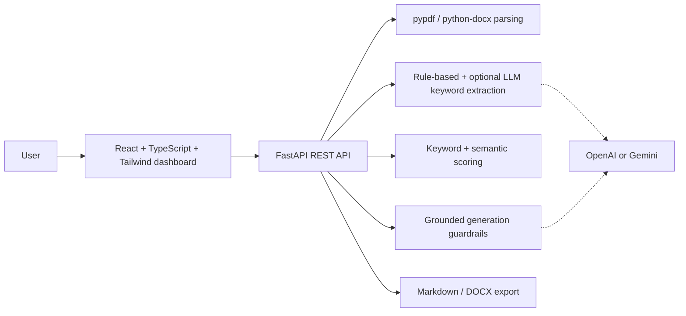

# AI Resume & Job Matcher

Full-stack AI web app for resume/job-description matching, ATS-style scoring, grounded resume rewrites, and tailored cover letters for entry-level AI Engineer, GenAI Developer, and LLM Application Developer roles.

## Features

- Upload PDF or DOCX resumes.
- Paste a job description and extract skills, tools, responsibilities, requirements, and education signals.
- Generate a transparent ATS-style match score:
  - Skills match: 40%
  - Tools/technologies match: 25%
  - Experience/responsibility match: 25%
  - Education/certification match: 10%
- Show matched keywords, missing keywords, weak areas, and recommendations.
- Show fit level, extracted JD signal categories, and resume evidence for matched keywords.
- Load a built-in sample resume/JD for quick demos without preparing files.
- Drag and drop resume uploads.
- Rewrite resume bullets and professional summary using only resume-backed experience.
- Generate a short tailored cover letter.
- Warn users not to invent experience.
- Export the match report as Markdown or DOCX.
- Download a tailored resume draft as Markdown or DOCX using only resume-supported evidence.
- Preview the gap-focused tailored resume before download, including a separate truthfulness review.
- Includes sample resume/JD data and backend tests.

## Screenshots

Dashboard:


The results page adds fit labeling, extracted job signals, and an evidence map.

- `docs/screenshot-results.png`

## Architecture



See [docs/architecture.md](docs/architecture.md) for the full flow.

## Project Structure

```text
ai-resume-job-matcher/
  backend/
    app/
      api/
      core/
      schemas/
      services/
    tests/
  frontend/
    src/
      components/
      lib/
      types/
  samples/
  examples/
  docs/
```

## Backend Setup

```powershell
cd backend
python -m venv .venv
.venv\Scripts\Activate.ps1
pip install -r requirements.txt
Copy-Item .env.example .env
uvicorn app.main:app --reload --host 127.0.0.1 --port 8000
```

The app works with deterministic local fallbacks when `AI_PROVIDER=none`.

Optional local embedding support:

```powershell
pip install -r requirements-ml.txt
```

To use OpenAI:

```env
AI_PROVIDER=openai
OPENAI_API_KEY=your_key_here
OPENAI_MODEL=gpt-4o-mini
```

To use Gemini:

```env
AI_PROVIDER=gemini
GOOGLE_API_KEY=your_key_here
GEMINI_MODEL=gemini-1.5-flash
```

Do not commit `.env` or API keys.

## Frontend Setup

```powershell
cd frontend
npm install
Copy-Item .env.example .env
npm run dev
```

Open `http://127.0.0.1:5173`.

## API Docs

FastAPI docs are available at `http://127.0.0.1:8000/docs`.

| Method | Endpoint | Purpose |
| --- | --- | --- |
| `POST` | `/api/upload-resume` | Upload PDF/DOCX, parse text, store resume temporarily |
| `POST` | `/api/analyze-match` | Extract JD keywords, score match, generate summary/bullets/cover letter |
| `POST` | `/api/rewrite-bullets` | Generate grounded rewritten bullets |
| `POST` | `/api/generate-cover-letter` | Generate grounded short cover letter |
| `POST` | `/api/export` | Export report as Markdown or DOCX |
| `POST` | `/api/tailored-resume` | Preview a grounded tailored resume and gap action plan |
| `POST` | `/api/export-tailored-resume` | Export a grounded tailored resume draft as Markdown or DOCX |

## Tests

```powershell
cd backend
pytest
```

Test coverage includes:

- PDF parsing
- DOCX parsing
- Keyword extraction
- Match score generation
- No-fabrication guardrail behavior

## Security And Quality

- API keys stay in `.env`, never in source code.
- Uploads are restricted to PDF and DOCX.
- Upload size is limited by `MAX_UPLOAD_MB`.
- Temporary upload files are deleted after parsing.
- Parsed resume text is stored temporarily in memory.
- Basic logging is enabled in FastAPI.
- AI outputs are constrained to uploaded resume evidence.
- Matched keywords include evidence snippets; unsupported keywords are kept as gaps.
- Tailored resume exports do not insert unsupported skills, tools, certifications, companies, or dates.

## Sample Data

- [samples/resumes/entry_level_ai_engineer_resume.md](samples/resumes/entry_level_ai_engineer_resume.md)
- `samples/resumes/entry_level_ai_engineer_resume.pdf`
- `samples/resumes/entry_level_ai_engineer_resume.docx`
- [samples/job_descriptions/ai_engineer_jd.md](samples/job_descriptions/ai_engineer_jd.md)
- [examples/match-report.md](examples/match-report.md)

Regenerate sample PDF/DOCX files:

```powershell
python scripts/generate_sample_documents.py
```

## Resume-Ready Project Description

AI Resume & Job Matcher is a full-stack AI application that parses resumes and job descriptions, scores ATS alignment, identifies missing keywords, rewrites resume bullets, and generates grounded cover letters for AI/GenAI roles.

## Resume Bullets

- Built an AI Resume & Job Matcher that parses resumes and job descriptions, scores ATS alignment, and generates grounded resume improvements.
- Implemented document parsing, keyword extraction, semantic similarity scoring, LLM-based bullet rewriting, and no-fabrication guardrails.
- Developed a React/TypeScript frontend and FastAPI backend with resume upload, JD analysis, match scoring, cover letter generation, and export workflows.
