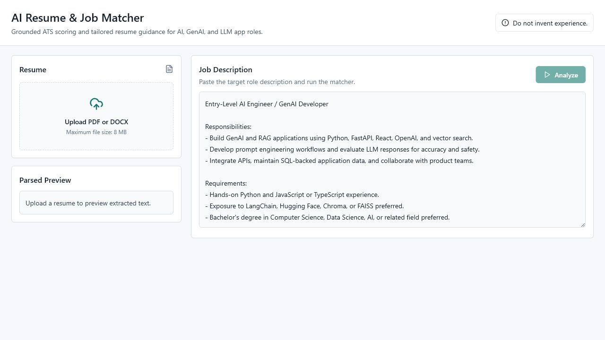
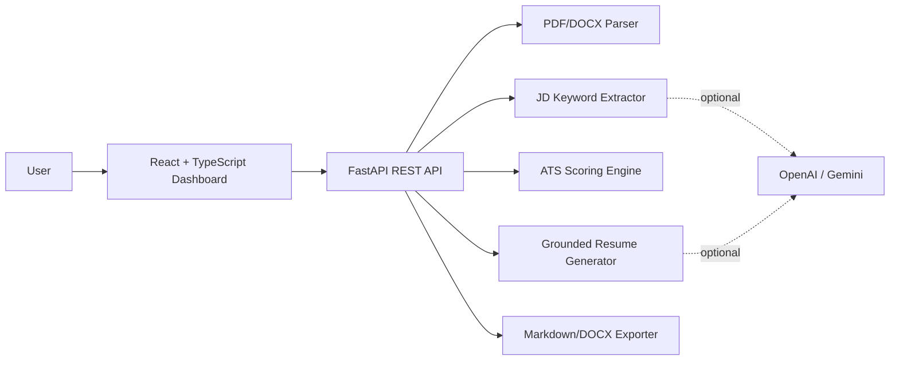

# ATS Score of Resume

AI Resume & Job Matcher is a full-stack web app that helps candidates compare a resume against a job description, understand ATS alignment, identify missing keywords, and generate grounded resume improvements without inventing experience.

The project is built for entry-level AI Engineer, GenAI Developer, and LLM Application Developer roles.

## Highlights

- Upload PDF or DOCX resumes.
- Paste a target job description.
- Parse resume text with `pypdf` and `python-docx`.
- Extract job-description skills, tools, responsibilities, requirements, and education signals.
- Score resume/job alignment with a transparent 0-100 ATS-style breakdown.
- Show matched keywords, missing keywords, weak areas, evidence snippets, and recommendations.
- Generate grounded professional summaries, rewritten bullets, and cover letters.
- Preview a gap-focused tailored resume using the uploaded resume's original section structure.
- Export match reports and tailored resumes as Markdown or DOCX.
- Keep unsupported gaps separate instead of adding fake skills, companies, dates, certifications, or experience.

## Tech Stack

| Layer | Tools |
| --- | --- |
| Frontend | React, TypeScript, Vite, Tailwind CSS |
| Backend | Python, FastAPI |
| Parsing | pypdf, python-docx |
| AI/LLM | OpenAI or Google Gemini-ready, deterministic fallback included |
| Similarity | Token cosine similarity, optional SentenceTransformers |
| Export | Markdown, python-docx |
| Testing | Pytest |

## Screenshots



## Core Workflow

1. Upload a PDF or DOCX resume.
2. Paste a job description.
3. Run match analysis.
4. Review the ATS score and category breakdown:
   - Skills match: 40%
   - Tools/technologies match: 25%
   - Experience/responsibility match: 25%
   - Education/certification match: 10%
5. Review matched keywords, missing keywords, weak areas, and evidence.
6. Preview a tailored resume draft that preserves the uploaded resume format.
7. Download the tailored resume or match report as DOCX/Markdown.

## No-Fabrication Guardrail

The app is designed to keep resume rewriting truthful:

- Supported keywords can be added only when the uploaded resume contains evidence.
- Unsupported job-description keywords are labeled as genuine gaps.
- Tailored resume exports do not insert unsupported skills, tools, companies, dates, certifications, or experience.
- Gap recommendations are shown separately as an action plan.

## Architecture



See [docs/architecture.md](docs/architecture.md) for more detail.

## Project Structure

```text
.
  backend/
    app/
      api/
      core/
      schemas/
      services/
    tests/
  frontend/
    src/
      components/
      lib/
      types/
  samples/
  examples/
  docs/
```

## Backend Setup

```powershell
cd backend
python -m venv .venv
.venv\Scripts\Activate.ps1
pip install -r requirements.txt
Copy-Item .env.example .env
uvicorn app.main:app --reload --host 127.0.0.1 --port 8000
```

The backend works without an API key when `AI_PROVIDER=none`.

Optional local embedding support:

```powershell
pip install -r requirements-ml.txt
```

OpenAI configuration:

```env
AI_PROVIDER=openai
OPENAI_API_KEY=your_key_here
OPENAI_MODEL=gpt-4o-mini
```

Gemini configuration:

```env
AI_PROVIDER=gemini
GOOGLE_API_KEY=your_key_here
GEMINI_MODEL=gemini-1.5-flash
```

Never commit `.env` or API keys.

## Frontend Setup

```powershell
cd frontend
npm install
Copy-Item .env.example .env
npm run dev
```

Open:

```text
http://127.0.0.1:5173
```

If the backend runs on a different port, update `frontend/.env`:

```env
VITE_API_BASE_URL=http://127.0.0.1:8000/api
```

## API Endpoints

FastAPI docs are available at:

```text
http://127.0.0.1:8000/docs
```

| Method | Endpoint | Purpose |
| --- | --- | --- |
| `POST` | `/api/upload-resume` | Upload and parse a PDF/DOCX resume |
| `POST` | `/api/analyze-match` | Score match and generate recommendations |
| `POST` | `/api/rewrite-bullets` | Generate grounded rewritten bullets |
| `POST` | `/api/generate-cover-letter` | Generate a grounded cover letter |
| `POST` | `/api/export` | Export match report as Markdown or DOCX |
| `POST` | `/api/tailored-resume` | Preview tailored resume and gap action plan |
| `POST` | `/api/export-tailored-resume` | Export tailored resume as Markdown or DOCX |

## Tests

```powershell
cd backend
pytest
```

Coverage includes:

- PDF parsing
- DOCX parsing
- Keyword extraction
- Match score generation
- No-fabrication guardrail behavior
- Tailored resume generation
- Resume-format preservation

## Sample Data

- [Sample resume Markdown](samples/resumes/entry_level_ai_engineer_resume.md)
- `samples/resumes/entry_level_ai_engineer_resume.pdf`
- `samples/resumes/entry_level_ai_engineer_resume.docx`
- [Sample job description](samples/job_descriptions/ai_engineer_jd.md)
- [Example match report](examples/match-report.md)

Regenerate sample PDF/DOCX files:

```powershell
python scripts/generate_sample_documents.py
```

## Security And Quality

- API keys are loaded from `.env` only.
- Uploads are restricted to PDF and DOCX.
- File size is limited by `MAX_UPLOAD_MB`.
- Temporary upload files are deleted after parsing.
- Parsed resume text is stored temporarily in memory.
- Backend logging is enabled.
- AI outputs are grounded in uploaded resume evidence.

## Resume-Ready Description

Built a full-stack AI Resume & Job Matcher that parses PDF/DOCX resumes, analyzes job descriptions, scores ATS alignment, identifies missing keywords, and generates grounded resume improvements for AI/GenAI roles.

## Resume Bullets

- Developed a full-stack AI Resume & Job Matcher using React, TypeScript, Tailwind CSS, Python, and FastAPI to analyze resume-job alignment for AI/GenAI roles.
- Implemented PDF/DOCX parsing, job-description keyword extraction, ATS-style scoring, semantic similarity, evidence mapping, and no-fabrication guardrails.
- Built a tailored resume generator that preserves the user’s original resume format, rewrites supported sections, separates genuine skill gaps, and exports DOCX/Markdown files.
- Added automated backend tests for document parsing, keyword extraction, match scoring, guardrail behavior, and tailored resume generation.
