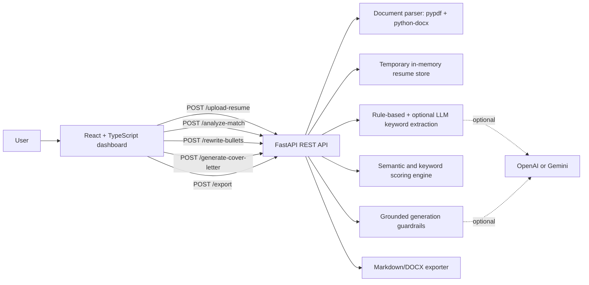

# Architecture

## Data Flow

1. The user uploads a PDF or DOCX resume.
2. FastAPI validates file type and size, extracts text, stores parsed text temporarily, and deletes the upload file.
3. The user submits a job description.
4. The backend extracts skills, tools, responsibilities, requirements, and education signals from the JD.
5. The scoring engine compares resume evidence to JD signals using exact keyword matching and lightweight semantic similarity.
6. The grounded generation layer rewrites summary, bullets, and cover letter content only from resume evidence.
7. The user exports a Markdown or DOCX report.

